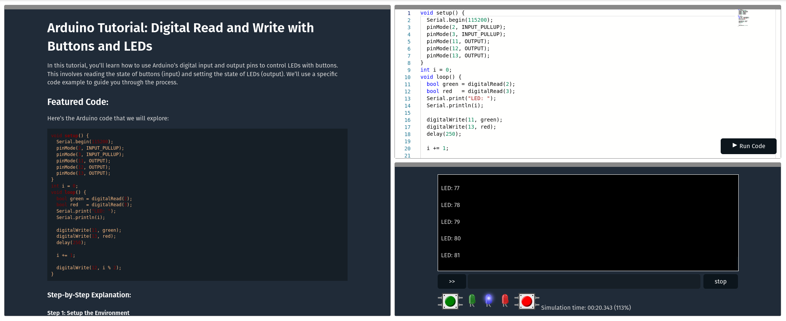
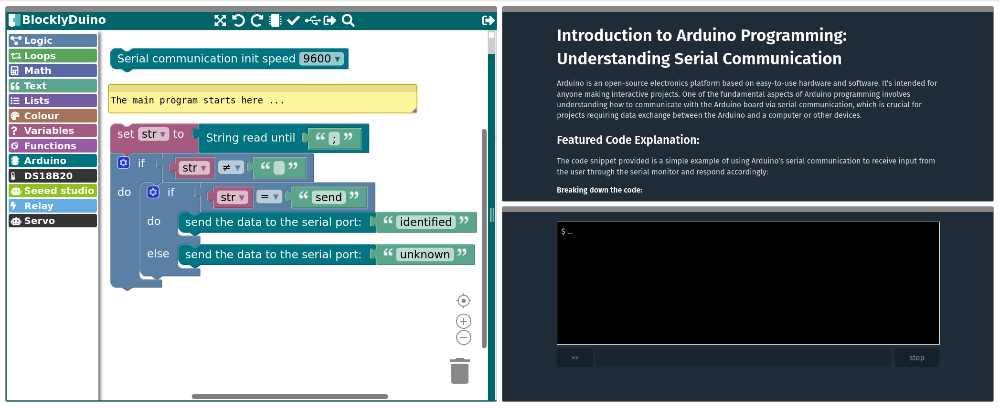

# lab-avr8js-simulation

Here we provide two simple examples on how to use the avr8js simulator in the edrys laboratory and how these can be combined with different editors.

To import these examples into the edrys-Lite app, simply copy one of the following URLs and paste it into the import dialog in settings, after you have created a new class.

## Arduino

This example combines:

- [module-editor](https://github.com/edrys-labs/module-editor): Simple minimal and configurable code editor.
- [module-markdown-it](https://github.com/edrys-labs/module-markdown-it): Markdown viewer used for documentation.
- [module-avr8js](https://github.com/edrys-labs/module-avr8js): An AVR simulator with a configurable periphery (for code compilation and execution).

This laboratory creates three rooms, without the need of open a station:

1. __Basics and Serial Communication__

   In this initial room, students will explore the foundational concepts of Arduino programming, focusing on serial communication. Serial communication allows Arduino to communicate with your computer or other devices.

2. __Digital Input and Output__

   Moving to the second room, learners will understand how to read digital inputs and control outputs. This is crucial for interfacing with various sensors and actuators.

3. __LED Grid Visualization with FastLED__

   In the final room, students will use the FastLED library to create colorful, dynamic patterns on an LED grid, integrating everything they've learned about programming and physical computing.

### Configuration Files

Either click on the link or import the configuration manually:

https://raw.githubusercontent.com/edrys-labs/lab-avr8js-simulation/main/laboratory/arduino.yaml

https://raw.githubusercontent.com/edrys-labs/lab-avr8js-simulation/main/laboratory/arduino.json

## Blockduino

This is a simplified version of the previous example, where the code editor is replaced by a block-based editor and it does only contain one room so far.

- [module-blockly-duino-v2](https://github.com/edrys-labs/module-blockly-duino-v2): Blockly-Duino2 web-editor.
- [module-markdown-it](https://github.com/edrys-labs/module-markdown-it): Markdown viewer used for documentation.
- [module-avr8js](https://github.com/edrys-labs/module-avr8js): An AVR simulator with a configurable periphery (for code compilation and execution).

### Configuration Files

Either click on the link or import the configuration manually:

https://raw.githubusercontent.com/edrys-labs/lab-avr8js-simulation/main/laboratory/blockduino.yaml

https://raw.githubusercontent.com/edrys-labs/lab-avr8js-simulation/main/laboratory/blockduino.json